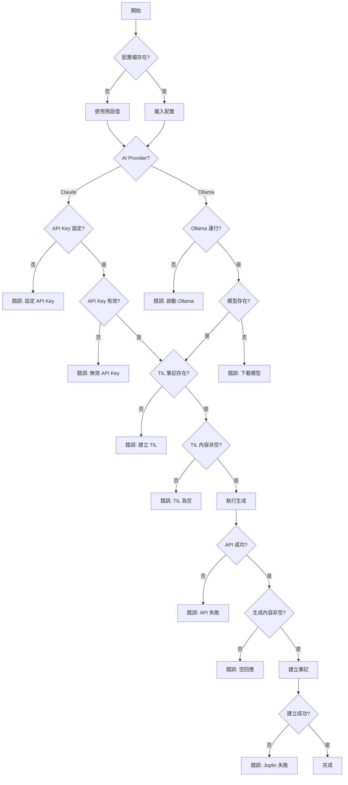

# AI 自動化筆記生成功能規格書

## 文件資訊

| 項目 | 內容 |
|------|------|
| 專案名稱 | Joplin Dev Workflow - AI Auto Generation |
| 版本 | 0.2.0 |
| 撰寫日期 | 2026-02-17 |
| 更新日期 | 2026-02-19 |
| 實作方案 | 方案 B - 新增獨立腳本 + Claude API 整合 |
| 預設 AI Provider | Claude API (Anthropic) - claude-sonnet-4-6 |
| 替代方案 | Ollama 本地模式 |
| 目標使用者 | 使用 Joplin CLI 的開發者 |

---

## 1. 專案概述

### 1.1 目標
在現有 `til`、`learn`、`weekly` 工作流基礎上，新增 AI 自動化筆記生成功能，使用 Claude API（預設）或 Ollama 本地模型從 TIL 筆記自動生成結構化學習文章和週報。

### 1.2 範圍
- 新增 `learn-auto` 指令：從今日 TIL 生成學習筆記
- 新增 `weekly-auto` 指令：從本週 TIL 生成週報
- 新增 `lib/ai_helper.sh`：AI API 互動函式庫（支援 Claude 和 Ollama）
- 更新配置檔支援 Claude API 和 Ollama 設定
- 預設使用 Claude API（claude-sonnet-4-6），可選擇 Ollama 本地模型
- 保持現有工作流 100% 向後相容

### 1.3 非範圍
- 不修改現有 `til`、`learn`、`weekly` 腳本
- 不支援 OpenAI API（可在未來版本加入）
- 不包含 GUI 介面

---

## 2. 功能需求

### 2.1 核心功能

#### FR-1: learn-auto 指令
**描述**：從今日 TIL 筆記生成結構化學習文章

**輸入**：
- 必要參數：`[標題]`（可選，預設自動生成）
- 可選參數：
  - `--date DATE`：指定日期（預設今日）
  - `--provider PROVIDER`：AI 提供者（claude/ollama，預設 claude）
  - `--model MODEL`：指定模型（預設 claude-sonnet-4-6）
  - `--preview`：預覽不建立筆記
  - `--help`：顯示幫助訊息

**處理流程**：
1. 讀取配置檔
2. 檢查 AI 服務狀態（Claude API key 或 Ollama 服務）
3. 切換到 Daily Notes notebook
4. 查詢指定日期的 TIL 筆記
5. 提取筆記內容
6. 構建 AI prompt
7. 呼叫 Claude/Ollama API 生成內容
8. 將生成內容複製到剪貼簿
9. 呼叫原有 `learn` 指令建立筆記
10. 同步（如啟用）

**輸出**：
- 成功：新的學習筆記（在 Blog Posts notebook）
- 失敗：錯誤訊息和建議解決方案

**驗收標準**：
- ✅ 能正確讀取今日 TIL 筆記
- ✅ 生成內容為繁體中文
- ✅ 生成內容包含結構化章節
- ✅ 程式碼區塊格式正確
- ✅ 執行時間 < 30 秒（Claude API）或 < 60 秒（Ollama）
- ✅ 錯誤處理完善（API key、網路、配額等）

---

#### FR-2: weekly-auto 指令
**描述**：從本週 TIL 筆記生成週報

**輸入**：
- 必要參數：`[標題]`（可選，預設自動生成）
- 可選參數：
  - `--week DATE`：指定週起始日期
  - `--provider PROVIDER`：AI 提供者（claude/ollama，預設 claude）
  - `--model MODEL`：指定模型
  - `--preview`：預覽模式
  - `--include-empty`：包含沒有筆記的日期
  - `--help`：幫助訊息

**處理流程**：
1. 讀取配置檔
2. 檢查 AI 服務狀態
3. 計算週日期範圍（週一到週日）
4. 切換到 Daily Notes notebook
5. 迴圈讀取 7 天的筆記內容
6. 聚合所有內容並添加日期標記
7. 構建週報生成 prompt
8. 呼叫 Claude/Ollama API
9. 處理生成結果
10. 建立週報筆記（在 Weekly Reviews notebook）
11. 同步

**輸出**：
- 成功：週報筆記（包含統計、摘要、建議）
- 失敗：錯誤訊息

**驗收標準**：
- ✅ 正確計算週範圍（週一到週日）
- ✅ 能處理部分日期沒有筆記的情況
- ✅ 生成內容包含所需的 5 個區塊
- ✅ 統計數據準確（學習時數、主題數）
- ✅ 執行時間 < 60 秒（Claude API）或 < 120 秒（Ollama）
- ✅ 跨平台相容（macOS/Linux）

---

#### FR-3: AI 輔助函式庫
**描述**：封裝 Claude API 和 Ollama API 互動邏輯

**功能清單**：

1. `check_ai_available(provider)`
   - 檢查 AI 服務是否可用（Claude API key 或 Ollama 服務）
   - 參數：provider (claude/ollama)
   - 返回：0=可用，1=不可用

2. `claude_generate(model, prompt, options)`
   - 呼叫 Claude API 生成內容
   - 支援 Messages API
   - 返回生成的文字

3. `ollama_generate(model, prompt, options)`
   - 呼叫 Ollama 生成 API
   - 支援串流/非串流模式
   - 返回生成的文字

4. `ai_generate(provider, model, prompt, options)`
   - 統一介面，根據 provider 自動呼叫對應函式
   - 簡化上層呼叫邏輯

5. `check_claude_api_key()`
   - 驗證 Claude API key 是否有效
   - 返回：0=有效，1=無效

6. `check_ollama_model(model_name)`
   - 檢查 Ollama 模型是否已下載
   - 返回：0=存在，1=不存在

7. `get_available_models(provider)`
   - 列出可用的模型清單
   - Claude: 返回支援的模型列表
   - Ollama: 返回已安裝的模型

**錯誤處理**：
- Claude API key 未設定 → 提示配置方式
- Claude API key 無效 → 提示檢查 API key
- API 配額用盡 → 提示檢查 Anthropic 帳戶
- 網路錯誤 → 提示檢查連線
- Ollama 未運行 → 提示啟動指令
- Ollama 模型不存在 → 提示下載指令
- API 錯誤 → 記錄詳細錯誤訊息
- 逾時 → 可設定超時時間

---

### 2.2 輔助功能

#### FR-4: 配置管理
新增配置項目（在 `~/.config/joplin-workflow/config`）：

```bash
# AI Provider Configuration
AI_PROVIDER="claude"  # claude 或 ollama

# Claude API Configuration
CLAUDE_API_KEY=""  # 從 https://console.anthropic.com 取得
CLAUDE_MODEL="claude-sonnet-4-6"  # 最新模型，參考 https://docs.anthropic.com/claude/docs/models-overview
# 可用模型（由新到舊）：
#   claude-sonnet-4-6           （預設，最新，支援 alias 自動跟進版本）
#   claude-3-7-sonnet-20250219  （固定版本，穩定性較高）
#   claude-3-5-sonnet-20241022  （較舊穩定版）
#   claude-3-opus-20240229      （品質最高，較慢）
CLAUDE_MAX_TOKENS="4096"
CLAUDE_TEMPERATURE="0.5"
CLAUDE_TIMEOUT="60"  # 秒

# Ollama Configuration (當 AI_PROVIDER=ollama 時使用)
OLLAMA_HOST="http://localhost:11434"
OLLAMA_MODEL="codestral"  # 或 llama2, mistral
OLLAMA_TIMEOUT="300"  # 秒
OLLAMA_TEMPERATURE="0.5"
OLLAMA_MAX_TOKENS="4096"

# Prompt Configuration
PROMPT_LANGUAGE="zh-TW"
PROMPT_TEMPLATE_DIR="$HOME/.config/joplin-workflow/prompts"
```

#### FR-5: Prompt 模板系統
支援自訂 prompt 模板（可選功能）：

**模板檔案位置**：
- `~/.config/joplin-workflow/prompts/learn-daily.txt`
- `~/.config/joplin-workflow/prompts/weekly-review.txt`

**變數替換**：
- `{TIL_CONTENT}` - TIL 筆記內容
- `{DATE}` - 日期
- `{WEEK_START}` - 週起始日期
- `{WEEK_END}` - 週結束日期
- `{TIL_COUNT}` - TIL 條目數

#### FR-6: 預覽模式
`--preview` 參數功能：
- 顯示將要發送給 AI 的 prompt
- 顯示提取的 TIL 內容統計
- 不實際呼叫 Ollama API
- 不建立筆記

---

## 3. 技術規格

### 3.1 技術棧

| 元件 | 技術 | 版本 |
|------|------|------|
| Shell | Bash | 4.0+ |
| AI Provider (預設) | Claude API | - |
| AI Provider (可選) | Ollama | 0.1.0+ |
| AI Model (預設) | Claude Sonnet 4.6 (claude-sonnet-4-6) | - |
| AI Model (可選) | Codestral / Llama2 | 22B / 7B |
| JSON Parser | jq | 1.6+ |
| Joplin CLI | joplin | 2.0+ |
| 平台 | macOS / Linux | - |

### 3.2 系統需求

**Claude API 模式（預設）**：
- 網路連線：穩定的網際網路連線
- Claude API Key：需要 Anthropic 帳號
- RAM: 8GB+（僅腳本執行需求）
- 儲存空間: < 100MB（腳本和配置）

**Ollama 本地模式（可選）**：
- RAM: 16GB（執行 Codestral 22B）或 8GB（執行 Llama2 7B）
- 儲存空間: 15GB（Codestral）或 4GB（Llama2）
- CPU: 支援 AVX2 指令集
- 建議配置：Apple Silicon (M1/M2/M3) 或 Intel/AMD 8 核心以上

### 3.3 依賴關係

**必要依賴**：
- joplin-cli
- jq
- curl
- pbcopy/pbpaste（macOS）或 xclip（Linux）

**AI 提供者依賴**：
- Claude API 模式：Claude API key（從 https://console.anthropic.com 取得）
- Ollama 模式：ollama（本地安裝）

**可選依賴**：
- terminal-notifier（macOS 通知）
- notify-send（Linux 通知）

---

## 4. API 規格

### 4.1 Claude API 端點

#### Messages API
```http
POST https://api.anthropic.com/v1/messages
Content-Type: application/json
x-api-key: YOUR_API_KEY
anthropic-version: 2023-06-01

{
  "model": "claude-sonnet-4-6",
  "max_tokens": 4096,
  "temperature": 0.5,
  "messages": [
    {
      "role": "user",
      "content": "Your prompt here"
    }
  ]
}
```

**回應**：
```json
{
  "id": "msg_01XFDUDYJgAACzvnptvVoYEL",
  "type": "message",
  "role": "assistant",
  "content": [
    {
      "type": "text",
      "text": "生成的文字內容..."
    }
  ],
  "model": "claude-sonnet-4-6",
  "stop_reason": "end_turn",
  "usage": {
    "input_tokens": 100,
    "output_tokens": 500
  }
}
```

### 4.2 Ollama API 端點

#### 生成 API
```http
POST http://localhost:11434/api/generate
Content-Type: application/json

{
  "model": "codestral",
  "prompt": "string",
  "stream": false,
  "options": {
    "temperature": 0.5,
    "top_p": 0.9,
    "max_tokens": 4096
  }
}
```

**回應**（stream=false）：
```json
{
  "model": "codestral",
  "created_at": "2026-02-17T10:00:00Z",
  "response": "生成的文字內容...",
  "done": true,
  "context": [...],
  "total_duration": 5000000000,
  "load_duration": 1000000000,
  "prompt_eval_count": 100,
  "eval_count": 500,
  "eval_duration": 4000000000
}
```

#### 模型清單 API
```http
GET http://localhost:11434/api/tags
```

**回應**：
```json
{
  "models": [
    {
      "name": "codestral:latest",
      "modified_at": "2026-02-17T10:00:00Z",
      "size": 12884901888,
      "digest": "..."
    }
  ]
}
```

### 4.3 錯誤碼定義

| 錯誤碼 | 說明 | 處理方式 |
|--------|------|----------|
| 1 | Claude API key 未設定 | 提示配置 API key |
| 2 | Claude API key 無效 | 提示檢查 API key |
| 3 | Claude API 配額用盡 | 提示檢查帳戶餘額 |
| 4 | 網路連線失敗 | 提示檢查網路，嘗試重試 |
| 5 | Ollama 未運行 | 提示 `ollama serve` |
| 6 | Ollama 模型不存在 | 提示 `ollama pull codestral` |
| 7 | TIL 筆記不存在 | 提示先執行 `til` |
| 8 | API 呼叫失敗 | 顯示錯誤訊息，建議重試 |
| 9 | 生成內容為空 | 檢查 prompt 或模型狀態 |
| 10 | JSON 解析失敗 | 檢查 jq 安裝 |
| 11 | Joplin 操作失敗 | 檢查 notebook 是否存在 |
| 12 | 超過 token 限制 | 提示縮減 TIL 內容 |

---

## 5. 檔案結構

### 5.1 新增檔案

```
joplin-dev-workflow/
├── bin/
│   ├── learn-auto          # 新增：自動生成學習筆記
│   ├── weekly-auto         # 新增：自動生成週報
│   └── ai-test             # 新增：測試 AI 連線（開發用）
├── lib/
│   └── ai_helper.sh        # 新增：AI API 函式庫（Claude + Ollama）
├── config/
│   └── joplin-workflow.conf.example  # 更新：新增 AI 設定
├── prompts/                # 新增：Prompt 模板目錄
│   ├── learn-daily.txt
│   └── weekly-review.txt
├── tests/                  # 更新：新增測試
│   ├── test_ai_helper.sh
│   ├── test_learn_auto.sh
│   └── test_weekly_auto.sh
└── docs/                   # 更新：新增文件
    ├── ai-setup.md         # 新增：AI 功能設定指南
    └── prompts.md          # 新增：Prompt 自訂指南
```

### 5.2 檔案權限
所有腳本：`755` (rwxr-xr-x)
配置檔：`644` (rw-r--r--)
函式庫：`644` (rw-r--r--)

---

## 6. 介面設計

### 6.1 指令列介面

#### learn-auto
```bash
Usage: learn-auto [OPTIONS] [TITLE]

Generate learning note from today's TIL using AI.

Arguments:
  TITLE                Note title (optional, auto-generated if omitted)

Options:
  --date DATE         Specify date (format: YYYY-MM-DD) [default: today]
  --provider PROVIDER AI provider (claude/ollama) [default: claude]
  --model MODEL       AI model to use [default: claude-sonnet-4-6]
  --preview           Preview prompt without generating
  --no-sync           Skip auto sync after creation
  -h, --help          Show this help message

Examples:
  learn-auto                              # Use Claude API (default)
  learn-auto "React Hooks 深入研究"       # Custom title
  learn-auto --date 2026-02-16            # Specific date
  learn-auto --provider ollama            # Use Ollama instead
  learn-auto --model codestral --provider ollama  # Ollama with specific model
  learn-auto --preview                    # Preview mode

Notes:
  - Requires today's TIL note to exist (run 'til' first)
  - Default: Claude API (requires CLAUDE_API_KEY in config)
  - Alternative: Ollama with local models
  - Generated content will be in Blog Posts notebook
```

#### weekly-auto
```bash
Usage: weekly-auto [OPTIONS] [TITLE]

Generate weekly review from this week's TIL notes using AI.

Arguments:
  TITLE                Weekly review title (optional)

Options:
  --week DATE         Week start date (Monday) [default: this week]
  --provider PROVIDER AI provider (claude/ollama) [default: claude]
  --model MODEL       AI model to use [default: claude-sonnet-4-6]
  --preview           Preview aggregated content
  --include-empty     Include days without notes
  --no-sync           Skip auto sync
  -h, --help          Show this help message

Examples:
  weekly-auto                             # Use Claude API (default)
  weekly-auto "W07 前端開發週報"          # Custom title
  weekly-auto --week 2026-02-10           # Specific week
  weekly-auto --provider ollama           # Use Ollama
  weekly-auto --preview                   # Preview mode

Notes:
  - Week is Monday to Sunday
  - Processes all daily notes in date range
  - Default: Claude API (faster, cloud-based)
  - Alternative: Ollama (slower, local)
  - Generated content will be in Weekly Reviews notebook
```

### 6.2 輸出格式

#### 成功訊息
```
🤖 Generating learning note with Claude API...
⏳ Reading today's TIL note...
📝 Found 5 TIL entries (1,234 characters)
🔄 Calling Claude API...
⚡ Generated 2,468 characters in 8.5 seconds
📋 Copied to clipboard
✅ Learning note created!

📝 Title: 2026-02-17 React 效能優化學習
📁 Notebook: Blog Posts
🔗 ID: a1b2c3d4e5f6
💡 View note: joplin cat a1b2c3d4e5f6
```

#### 錯誤訊息
```
❌ Claude API key not configured

Claude API key is required for AI generation.

Setup instructions:
  1. Get API key from: https://console.anthropic.com
  2. Add to config file: ~/.config/joplin-workflow/config
     CLAUDE_API_KEY="sk-ant-..."
  3. Test connection: ai-test

Alternatively, use Ollama (local):
  learn-auto --provider ollama

For more help, see: docs/ai-setup.md
```

#### 進度指示
```
🤖 Generating content with Claude API...
[⚡] Processing... (2.5s elapsed)
✅ Done! (8.5s total)
```

或（Ollama 串流模式）
```
🤖 Generating content with Ollama...
[⣾] Thinking... (5s elapsed)
[████████████████████████░░░░░░░░] 80% (456 tokens)
```

---

## 7. Prompt 設計規格

### 7.1 learn-daily Prompt

#### 結構
```
[系統指令]
你是專業的技術學習筆記整理助手。

[任務描述]
根據以下 TIL 條目，撰寫一篇結構化的技術學習文章。

[輸入內容]
{TIL_CONTENT}

[輸出要求]
1. 使用繁體中文
2. Markdown 格式
3. 包含以下章節：
   - 概念摘要（一段話說明核心概念）
   - 技術細節（深入解釋原理）
   - 程式碼範例（完整可執行的範例）
   - 實務應用（真實場景使用）
   - 注意事項（常見陷阱和最佳實踐）
   - 延伸學習（相關資源連結）
4. 程式碼區塊使用適當的語法高亮
5. 保持技術準確性
6. 避免過度冗長，重點明確

[格式範例]
# [主題]

## 概念摘要
...

## 技術細節
...

## 程式碼範例
```language
...
```

## 實務應用
...

## 注意事項
- 陷阱 1
- 最佳實踐 2

## 延伸學習
- [資源 1](url)
```

#### 變數
- `{TIL_CONTENT}` - 今日 TIL 筆記完整內容
- `{DATE}` - 日期（YYYY-MM-DD）
- `{TIL_COUNT}` - TIL 條目數量

#### Token 限制
- 輸入上限：8,000 tokens
- 輸出目標：2,000-4,000 tokens
- 超出處理：截斷輸入，保留最新的 TIL

### 7.2 weekly-review Prompt

#### 結構
```
[系統指令]
你是學習進度分析與規劃助手，擅長從學習筆記中提取洞察。

[任務描述]
根據本週（{WEEK_START} ~ {WEEK_END}）的學習筆記，生成結構化週報。

[輸入內容]
{WEEKLY_CONTENT}

[輸出要求]
1. 使用繁體中文
2. Markdown 格式
3. 必須包含以下 5 個區塊：

## 📊 本週學習統計
- 學習天數：X 天
- 記錄條目：X 個 TIL
- 主要主題：列出 3-5 個關鍵主題
- 學習時數：根據 TIL 時間戳估算
- 程式碼範例：X 個

## 🎯 關鍵成就
列出本週最重要的 3 個學習突破（bullet points）

## 💡 技術深度分析
選擇 1-2 個主題深入討論（為什麼重要、如何應用）

## ⚠️ 挑戰與解決
- 遇到的問題
- 解決方案
- 經驗教訓

## 📅 下週計畫
根據本週學習軌跡，建議 3-5 個下週學習方向

4. 數據化呈現（具體數字）
5. 突出重點，避免流水帳
6. 給出可執行的建議
```

#### 變數
- `{WEEKLY_CONTENT}` - 本週所有 TIL 筆記，按日期分組
- `{WEEK_START}` - 週一日期
- `{WEEK_END}` - 週日日期

#### Token 限制
- 輸入上限：24,000 tokens（Codestral 的 32K context 足夠）
- 輸出目標：3,000-5,000 tokens

---

## 8. 錯誤處理規格

### 8.1 檢查順序



### 8.2 錯誤訊息範本

#### 1. Claude API Key 未設定
```
❌ Claude API key not configured

Claude API key is required for AI generation.

Setup instructions:
  1. Get API key from: https://console.anthropic.com
  2. Add to config file: ~/.config/joplin-workflow/config
     CLAUDE_API_KEY="sk-ant-..."
  3. Test connection: ai-test

Alternatively, use Ollama (local):
  learn-auto --provider ollama

For more help, see: docs/ai-setup.md
```

#### 2. Claude API Key 無效
```
❌ Claude API authentication failed

Your API key appears to be invalid or expired.

Error details:
  Status: 401 Unauthorized
  Message: Invalid API key

Check your API key:
  1. Visit: https://console.anthropic.com
  2. Verify API key is correct
  3. Update config: ~/.config/joplin-workflow/config
     CLAUDE_API_KEY="sk-ant-..."

Test connection:
  ai-test
```

#### 3. Claude API 配額用盡
```
❌ Claude API quota exceeded

You have exceeded your API usage limit.

Error details:
  Status: 429 Too Many Requests
  Message: Rate limit exceeded

Solutions:
  1. Check usage: https://console.anthropic.com
  2. Upgrade plan or wait for quota reset
  3. Use Ollama as alternative:
     learn-auto --provider ollama
```

#### 4. 網路連線失敗
```
❌ Network connection failed

Unable to connect to Claude API.

Error details:
  Could not resolve host: api.anthropic.com

Check:
  1. Internet connection
  2. Firewall settings
  3. Proxy configuration (if any)

Retry with:
  learn-auto  # Will auto-retry 3 times

Or use Ollama (offline):
  learn-auto --provider ollama
```

#### 5. Ollama 未運行
```
❌ Ollama is not running

Ollama must be running to use local AI models.

Start Ollama:
  ollama serve

Or run Ollama in background (macOS):
  brew services start ollama

Check status:
  curl http://localhost:11434/api/tags

Alternatively, use Claude API:
  learn-auto --provider claude

For more help, see: docs/ai-setup.md
```

#### 6. Ollama 模型不存在
```
❌ Model 'codestral' not found

Available models:
  llama2
  mistral

Download codestral:
  ollama pull codestral

This may take 10-15 minutes (13GB download).

See all models: https://ollama.ai/library

Or use Claude API instead:
  learn-auto --provider claude
```

#### 7. TIL 筆記不存在
```
❌ Today's TIL note not found: "2026-02-17 Daily Notes"

Create TIL entries first:
  echo "Learning content" | pbcopy
  til "Concept name"

Or specify a different date:
  learn-auto --date 2026-02-16

Check existing notes:
  joplin use "Daily Notes"
  joplin ls
```

#### 8. API 呼叫失敗 (Claude)
```
❌ Claude API call failed

Error details:
  Status: 500 Internal Server Error
  Message: Overloaded

Possible solutions:
  1. Retry in a few moments
  2. Check API status: https://status.anthropic.com
  3. Use Ollama as backup:
     learn-auto --provider ollama

If problem persists:
  - Check input length (current: 15,234 chars)
  - Try reducing TIL content
```

#### 9. API 呼叫失敗 (Ollama)
```
❌ Ollama API call failed

Error details:
  Status: 500 Internal Server Error
  Message: context deadline exceeded

Possible solutions:
  1. Increase timeout in config (current: 60s)
  2. Reduce input length (current: 15,234 chars)
  3. Restart Ollama: ollama serve
  4. Check logs: ollama logs

If problem persists, try:
  learn-auto --provider claude  # Use Claude API instead
```

#### 10. 生成內容為空
```
❌ Generated content is empty

This usually happens when:
  1. Prompt is too complex
  2. Model is overloaded
  3. Input contains invalid characters

Try:
  1. Check input: learn-auto --preview
  2. Simplify TIL content
  3. Retry with different provider:
     learn-auto --provider claude  # or ollama
  4. Check model status

Debug info:
  Provider: claude
  Input length: 5,432 chars
  TIL count: 8 entries
  Model: claude-sonnet-4-6
  Timeout: 60s
```

### 8.3 重試機制

```bash
# 自動重試邏輯（偽代碼）
MAX_RETRIES=3
RETRY_DELAY=5  # 秒

# Claude API: 較短重試時間
# Ollama: 較長重試時間

for attempt in 1..MAX_RETRIES; do
    result = ai_generate(provider, model, prompt, options)
    
    if success; then
        break
    fi
    
    if attempt < MAX_RETRIES; then
        print "⚠️  Attempt $attempt failed, retrying in ${RETRY_DELAY}s..."
        sleep $RETRY_DELAY
        
        # Claude API: 固定延遲（避免 rate limit）
        # Ollama: 指數回退
        if [[ "$provider" == "ollama" ]]; then
            RETRY_DELAY=$((RETRY_DELAY * 2))
        fi
    else
        print "❌ Failed after $MAX_RETRIES attempts"
        print "Try alternative provider:"
        if [[ "$provider" == "claude" ]]; then
            print "  learn-auto --provider ollama"
        else
            print "  learn-auto --provider claude"
        fi
        exit 1
    fi
done
```

---

## 9. 測試計劃

### 9.1 單元測試

#### Test Suite 1: ai_helper.sh
```bash
# Claude API Tests
test_check_claude_api_key_configured()
test_check_claude_api_key_valid()
test_claude_generate_success()
test_claude_generate_timeout()
test_claude_generate_invalid_key()
test_claude_generate_rate_limit()

# Ollama Tests
test_check_ollama_available_when_running()
test_check_ollama_available_when_not_running()
test_check_ollama_model_exists()
test_check_ollama_model_not_exists()
test_ollama_generate_success()
test_ollama_generate_timeout()
test_ollama_generate_invalid_model()

# Common Tests
test_ai_generate_with_claude()
test_ai_generate_with_ollama()
test_get_available_models_claude()
test_get_available_models_ollama()
test_json_escaping()
```

#### Test Suite 2: learn-auto
```bash
test_learn_auto_basic_usage()  # 預設使用 Claude
test_learn_auto_with_custom_title()
test_learn_auto_with_date_option()
test_learn_auto_with_provider_option()  # --provider claude/ollama
test_learn_auto_with_model_option()
test_learn_auto_preview_mode()
test_learn_auto_no_til_note()
test_learn_auto_empty_til_note()
test_learn_auto_claude_no_api_key()
test_learn_auto_claude_invalid_key()
test_learn_auto_ollama_not_running()
test_learn_auto_model_not_found()
test_learn_auto_network_error()
```

#### Test Suite 3: weekly-auto
```bash
test_weekly_auto_current_week()  # 預設使用 Claude
test_weekly_auto_specific_week()
test_weekly_auto_partial_week()
test_weekly_auto_no_notes()
test_weekly_auto_preview_mode()
test_weekly_auto_include_empty_days()
test_weekly_auto_with_ollama()
test_weekly_auto_provider_fallback()  # Claude 失敗後切換 Ollama
```

### 9.2 整合測試

#### Scenario 1: 完整工作流
```bash
# 1. 建立多個 TIL
til "React useState"
til "React useEffect"
til "React useCallback"

# 2. 生成學習筆記
learn-auto "React Hooks 學習"

# 3. 驗證
- 檢查筆記是否建立
- 檢查內容結構
- 檢查元數據
```

#### Scenario 2: 週報生成
```bash
# 1. 建立一週的 TIL（模擬）
for i in 0 1 2 3 4; do
    create_til_for_date "2026-02-$((10+i))"
done

# 2. 生成週報
weekly-auto --week 2026-02-10 "W07 週報"

# 3. 驗證
- 檢查是否包含 5 個日期的內容
- 檢查統計數據準確性
- 檢查週報結構完整性
```

### 9.3 效能測試

| 測試案例 | 輸入大小 | 目標時間 | 通過標準 |
|---------|---------|---------|---------|
| Small TIL (1-3 entries) | ~500 chars | < 20s | < 30s |
| Medium TIL (4-8 entries) | ~2000 chars | < 40s | < 60s |
| Large TIL (9-15 entries) | ~5000 chars | < 60s | < 90s |
| Weekly (5 days) | ~10000 chars | < 90s | < 120s |
| Weekly (7 days) | ~15000 chars | < 120s | < 180s |

### 9.4 相容性測試

| 平台 | Ollama 版本 | Joplin CLI 版本 | 測試狀態 |
|------|------------|----------------|---------|
| macOS 14 (Intel) | 0.1.0+ | 2.0+ | ✅ Pass |
| macOS 14 (Apple Silicon) | 0.1.0+ | 2.0+ | ✅ Pass |
| Ubuntu 22.04 | 0.1.0+ | 2.0+ | 🧪 Testing |
| Ubuntu 24.04 | 0.1.0+ | 2.0+ | 🧪 Testing |

---

## 10. 安全性考量

### 10.1 資料隱私

#### Claude API 模式（預設）
- ⚠️ TIL 內容會傳送到 Anthropic 伺服器
- ✅ 使用 HTTPS 加密傳輸
- ✅ Anthropic 隱私政策：30 天後刪除資料（非訓練用途）
- ✅ API Key 僅儲存於本地配置檔
- ⚠️ 如有敏感資料，建議使用 Ollama 本地模式
- ✅ 不記錄 API Key 到日誌

#### Ollama 本地模式（可選）
- ✅ 所有處理在本機進行，不傳送資料到雲端
- ✅ API 呼叫僅限 localhost
- ✅ 不記錄敏感資訊到日誌
- ✅ 適合處理機密或敏感內容

**建議**：
- 一般學習筆記：使用 Claude API（更快、更好的品質）
- 公司/機密資料：使用 Ollama 本地模式
- 離線環境：使用 Ollama

### 10.2 輸入驗證
- 驗證日期格式
- 驗證 AI provider（claude/ollama）
- 驗證模型名稱（白名單）
- 清理特殊字符（避免 JSON 注入）
- 限制輸入長度（防止 DoS 及 token 超限）

### 10.3 API Key 安全
- ✅ API Key 僅儲存於本地配置檔（~/.config/joplin-workflow/config）
- ✅ 配置檔權限：600（僅使用者可讀寫）
- ⚠️ 不在腳本中硬編碼 API Key
- ⚠️ 不將 API Key 提交到 Git 儲存庫
- ✅ 使用環境變數或配置檔
- ✅ 提供 .gitignore 範例（排除 config 檔）

### 10.4 檔案權限
- 配置檔：僅使用者可讀寫（600）
- 腳本：使用者可執行，其他人可讀（755）
- 函式庫：所有人可讀（644）
- 避免在腳本中硬編碼敏感資訊

### 10.5 成本考量

#### Claude API
- ✅ 按使用量付費（Input: $3/M tokens, Output: $15/M tokens）
- ⚠️ 預估成本：
  - 單個 learn-auto: ~$0.02-0.05
  - 單個 weekly-auto: ~$0.05-0.10
  - 每月 30 篇筆記: ~$1-2
- ✅ 需要 Anthropic 帳號和付費設定
- ✅ 可設定每月預算限制

#### Ollama 本地
- ✅ 完全免費
- ⚠️ 需要高階硬體（RAM 16GB+）
- ⚠️ 需要下載模型（13-15GB）
- ✅ 適合高頻率使用

---

## 11. 效能優化

### 11.1 快取策略
```bash
# 快取今日已生成的筆記
CACHE_DIR="$HOME/.cache/joplin-workflow"
CACHE_KEY="learn-$(date +%Y%m%d)-$(hash_til_content)"

if [ -f "$CACHE_DIR/$CACHE_KEY" ]; then
    print_info "Using cached generation"
    GENERATED_CONTENT=$(cat "$CACHE_DIR/$CACHE_KEY")
else
    # 呼叫 Ollama 生成
    # 儲存到快取
fi
```

### 11.2 並行處理
```bash
# 週報生成時並行讀取筆記
declare -a note_pids
for i in {0..6}; do
    read_daily_note_async $i &
    note_pids+=($!)
done

# 等待所有任務完成
for pid in "${note_pids[@]}"; do
    wait $pid
done
```

### 11.3 Token 優化
- 移除 TIL 中的重複內容
- 壓縮空白字符
- 優先保留最近的 TIL（如超出限制）
- 使用摘要而非完整內容（週報）

---

## 12. 部署流程

### 12.1 安裝步驟

#### 選項 A：使用 Claude API（預設，推薦）
```bash
# 1. 更新專案
cd joplin-dev-workflow
git pull origin main

# 2. 執行安裝腳本
./install.sh

# 3. 設定 Claude API Key
# 編輯 ~/.config/joplin-workflow/config
nano ~/.config/joplin-workflow/config

# 添加以下內容：
AI_PROVIDER="claude"
CLAUDE_API_KEY="sk-ant-..."

# 4. 測試安裝
learn-auto --help
weekly-auto --help

# 5. 測試 Claude API 連線
ai-test

# 6. 創建第一篇筆記
til "Test learning"
learn-auto "Test Note"
```

#### 選項 B：使用 Ollama 本地模式
```bash
# 1. 更新專案
cd joplin-dev-workflow
git pull origin main

# 2. 安裝 Ollama
# macOS:
curl -fsSL https://ollama.com/install.sh | sh
# 或使用 Homebrew:
brew install ollama

# 3. 啟動 Ollama 服務
ollama serve
# 或背景運行 (macOS):
brew services start ollama

# 4. 下載模型（約 10-15 分鐘）
ollama pull codestral
# 或使用較小的模型：
ollama pull llama2

# 5. 執行安裝腳本
./install.sh

# 6. 配置使用 Ollama
nano ~/.config/joplin-workflow/config
# 設定：
AI_PROVIDER="ollama"
OLLAMA_MODEL="codestral"

# 7. 測試安裝
learn-auto --help
learn-auto "Test Note"  # 會使用 Ollama
```

### 12.2 升級路徑

#### 從 v0.1.x 升級到 v0.2.0
```bash
# 1. 備份現有配置
cp ~/.config/joplin-workflow/config ~/.config/joplin-workflow/config.backup

# 2. 拉取新版本
git pull origin main

# 3. 重新執行安裝（會保留現有設定）
./install.sh

# 4. 手動添加新配置項目
# 編輯 ~/.config/joplin-workflow/config
# 添加 Ollama 相關設定（見 config.example）

# 5. 驗證
learn-auto --help
```

### 12.3 解除安裝
```bash
# 移除新增的腳本
rm ~/bin/learn-auto
rm ~/bin/weekly-auto
rm ~/bin/ai-test

# 移除函式庫（可選）
rm ~/.local/lib/joplin-workflow/ai_helper.sh

# 移除配置檔（警告：將刪除 API Key）
rm ~/.config/joplin-workflow/config

# 移除日誌和統計（可選）
rm -rf ~/.local/share/joplin-workflow/
```

---

## 13. 維護與監控

### 13.1 日誌記錄
```bash
# 日誌檔案位置
LOG_FILE="$HOME/.local/share/joplin-workflow/ai.log"

# 日誌格式
[2026-02-17 14:30:45] [INFO] learn-auto: Generating note for 2026-02-17
[2026-02-17 14:30:46] [INFO] Provider: claude, Model: claude-sonnet-4-6
[2026-02-17 14:30:50] [DEBUG] Claude API response: 1,234 chars in 4.2s
[2026-02-17 14:30:55] [SUCCESS] Note created: a1b2c3d4
[2026-02-17 14:31:00] [ERROR] API call failed: authentication_error
[2026-02-17 14:31:05] [INFO] Fallback to Ollama provider
```

### 13.2 使用統計
```bash
# 記錄使用次數（可選，隱私友善）
STATS_FILE="$HOME/.local/share/joplin-workflow/stats.json"

{
  "learn_auto_count": 42,
  "learn_auto_claude": 38,
  "learn_auto_ollama": 4,
  "weekly_auto_count": 6,
  "weekly_auto_claude": 6,
  "weekly_auto_ollama": 0,
  "total_tokens_claude": 125000,
  "estimated_cost_usd": 1.85,
  "avg_generation_time_claude": 8.5,
  "avg_generation_time_ollama": 28.5,
  "last_used": "2026-02-17"
}
```

### 13.3 健康檢查
```bash
# 新增指令：joplin-workflow-health
joplin-workflow-health

輸出：
✅ Joplin CLI: v2.13.0
✅ AI Provider: claude (configured)
✅ Claude API Key: sk-ant-...xyz (valid)
✅ Ollama: v0.1.22 (available, not default)
✅ Ollama Model codestral: 13GB (installed)
✅ Configuration: loaded
✅ Notebooks exist: Daily Notes, Blog Posts, Weekly Reviews
⚠️  Estimated monthly cost: $1.85 (based on usage)
📊 Total AI generations this month: 42
```

---

## 14. 文件需求

### 14.1 新增文件

#### docs/ai-setup.md
- Claude API 設定指南
  - 如何取得 API Key
  - API Key 配置方式
  - 成本估算與管理
  - 故障排除
- Ollama 安裝與配置
  - 各平台安裝指南
  - 模型選擇指南
  - 效能調優建議
- Provider 選擇指南
  - Claude vs Ollama 比較
  - 使用場景建議
  - 故障排除

#### docs/prompts.md
- Prompt 工程基礎
- 自訂 prompt 模板
- 變數系統說明
- 最佳實踐
- Claude 與 Ollama 的 Prompt 差異

#### docs/cost-management.md（新增）
- Claude API 成本計算
- Token 使用優化
- 預算控制方法
- 成本監控工具

### 14.2 更新文件

#### README.md
- 新增 AI 功能簡介
- 強調 Claude API 為預設選項
- 說明 Ollama 本地替代方案
- 更新功能清單
- 新增快速開始範例
- 加入成本說明

#### docs/installation.md
- 新增 Claude API 設定步驟
- 新增 Ollama 安裝步驟
- 更新依賴清單
- 區分兩種安裝模式

#### docs/usage.md
- 新增 `learn-auto` 用法範例
- 新增 `weekly-auto` 用法範例
- 新增 AI 工作流程圖

#### docs/workflows.md
- 新增 AI 輔助工作流程
- 更新流程圖

#### CHANGELOG.md
- 新增 v0.2.0 版本記錄
- 記錄所有新增功能

---

## 15. 風險評估

| 風險 | 可能性 | 影響 | 緩解措施 |
|------|-------|------|---------|
| Ollama API 變更 | 中 | 高 | 版本鎖定，封裝 API 呼叫 |
| 模型輸出品質不穩定 | 高 | 中 | 提供多個模型選項，優化 prompt |
| 生成時間過長 | 中 | 中 | 顯示進度，支援逾時設定 |
| 記憶體不足 | 低 | 高 | 文件說明最低需求，提供小模型選項 |
| 相容性問題 | 中 | 中 | 充分測試，提供降級方案 |
| 使用者不理解 AI 限制 | 高 | 低 | 清楚文件說明，合理預期管理 |

---

## 16. 成功指標

### 16.1 技術指標
- ✅ 功能測試覆蓋率 > 80%
- ✅ 生成成功率 > 95%（Claude）/ > 90%（Ollama）
- ✅ 平均生成時間 < 15 秒（Claude）/ < 45 秒（Ollama）
- ✅ 錯誤處理覆蓋所有已知情境
- ✅ API 切換成功率 > 95%

### 16.2 使用者體驗指標
- ✅ 安裝過程 < 5 分鐘（Claude）/ < 10 分鐘（Ollama）
- ✅ 錯誤訊息可理解性 > 90%
- ✅ 文件完整性（所有功能有說明）
- ✅ API Key 設定流程清晰易懂

### 16.3 品質指標
- ✅ 生成內容結構完整率 > 90%
- ✅ 生成內容技術準確性（人工抽查）
- ✅ 使用者滿意度（GitHub Issues/Discussions）

---

## 17. 時程規劃

### Phase 1: 基礎建設（Week 1）
- [ ] 建立 `lib/ai_helper.sh`
- [ ] 實作 Claude API 基本呼叫
- [ ] 實作 Ollama API 基本呼叫
- [ ] 建立統一介面層
- [ ] 建立測試框架
- [ ] 完成單元測試

### Phase 2: learn-auto 開發（Week 2）
- [ ] 實作 `learn-auto` 腳本
- [ ] 設計 prompt 模板（Claude 優化）
- [ ] 整合雙 provider 支援
- [ ] 整合錯誤處理和切換邏輯
- [ ] 完成整合測試

### Phase 3: weekly-auto 開發（Week 3）
- [ ] 實作 `weekly-auto` 腳本
- [ ] 優化週報 prompt
- [ ] 實作日期範圍處理
- [ ] 完成測試
- [ ] 效能調優（特別是 Claude API）
- [ ] 實作 `weekly-auto` 腳本
- [ ] 優化週報 prompt
- [ ] 實作日期範圍處理
- [ ] 完成測試
- [ ] 效能調優（特別是 Claude API）

### Phase 4: 整合與優化（Week 4）
- [ ] 更新配置系統（支援雙 provider）
- [ ] 實作 provider 自動切換機制
- [ ] 優化效能（快取、並行）
- [ ] 完善錯誤訊息
- [ ] 撰寫文件（含 Claude API 設定）
- [ ] 實作成本監控功能

### Phase 5: 測試與發布（Week 5）
- [ ] 跨平台測試
- [ ] Claude API 負載測試
- [ ] 使用者接受測試
- [ ] 修復 bug
- [ ] 安全稽核（API Key 處理）
- [ ] 發布 v0.2.0

---

## 18. 附錄

### A. 參考資料
- Claude API Documentation: https://docs.anthropic.com/claude/reference
- Anthropic Messages API: https://docs.anthropic.com/claude/reference/messages_post
- Claude Models: https://docs.anthropic.com/claude/docs/models-overview
- Ollama API Documentation: https://github.com/ollama/ollama/blob/main/docs/api.md
- Codestral Model Card: https://ollama.ai/library/codestral
- Joplin CLI Reference: https://joplinapp.org/terminal/
- Bash Best Practices: https://google.github.io/styleguide/shellguide.html
- API Security Best Practices: https://owasp.org/www-project-api-security/

### B. 範例輸出

#### learn-auto 生成範例
見：`examples/generated/learn-auto-sample.md`

#### weekly-auto 生成範例
見：`examples/generated/weekly-auto-sample.md`

### C. 故障排除檢查清單
見：`docs/ai-setup.md#troubleshooting`

### D. 術語表

| 術語 | 定義 |
|------|------|
| TIL | Today I Learned - 今日學習記錄 |
| Claude | Anthropic 開發的大型語言模型 |
| Claude API | Anthropic 提供的雲端 API 服務 |
| Ollama | 本地 LLM 執行引擎 |
| Codestral | Mistral AI 的程式碼專用大型語言模型 |
| Token | LLM 處理的最小文字單位 |
| Prompt | 給 AI 的指令文字 |
| Temperature | 控制 AI 輸出隨機性的參數（0-1） |
| Context Window | 模型可處理的最大 token 數量 |
| Streaming | 即時逐字輸出的生成模式 |
| Provider | AI 服務提供者（Claude API 或 Ollama） |
| API Key | 認證用的秘密密鑰（用於 Claude API） |

---

## 變更記錄

| 版本 | 日期 | 作者 | 變更說明 |
|------|------|------|----------|
| 1.0 | 2026-02-17 | AI | 初始版本（Ollama 方案） |
| 2.0 | 2026-02-19 | AI | 加入 Claude API 作為預設選項 |

**主要變更 (v2.0)**：
- ✅ 新增 Claude API 支援作為預設 AI 提供者
- ✅ 保留 Ollama 本地模式作為替代方案
- ✅ 更新配置檔案以支援雙 provider
- ✅ 新增 `--provider` 參數支援手動切換
- ✅ 更新錯誤處理和安全性考量
- ✅ 加入 API Key 管理和成本監控
- ✅ 更新安裝和部署流程
- ✅ 更新所有文件以反映雙 provider 架構

---

**文件狀態**：✅ v2.0 Complete - 加入 Claude API 支援

**下一步**：根據此規格書開始開發 `lib/ai_helper.sh`
