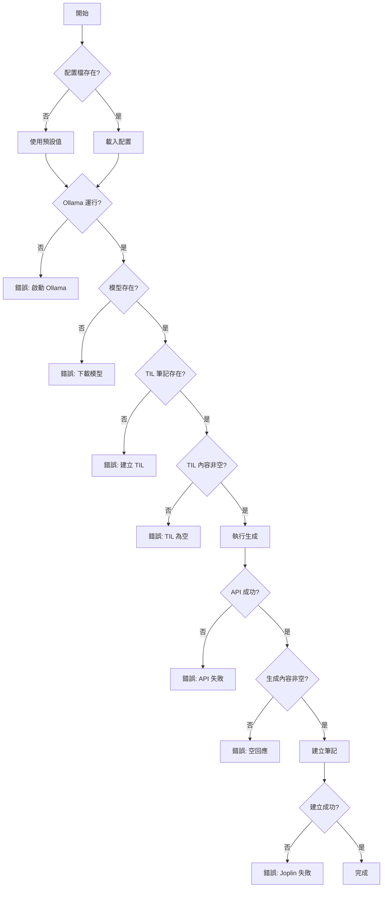

# Ollama 自動化筆記生成功能規格書

## 文件資訊

| 項目 | 內容 |
|------|------|
| 專案名稱 | Joplin Dev Workflow - AI Auto Generation |
| 版本 | 0.2.0 |
| 撰寫日期 | 2026-02-17 |
| 實作方案 | 方案 B - 新增獨立腳本 |
| 目標使用者 | 使用 Joplin CLI 的開發者 |

---

## 1. 專案概述

### 1.1 目標
在現有 `til`、`learn`、`weekly` 工作流基礎上，新增 AI 自動化筆記生成功能，使用 Ollama Codestral 模型從 TIL 筆記自動生成結構化學習文章和週報。

### 1.2 範圍
- 新增 `learn-auto` 指令：從今日 TIL 生成學習筆記
- 新增 `weekly-auto` 指令：從本週 TIL 生成週報
- 新增 `lib/ollama_helper.sh`：Ollama API 互動函式庫
- 更新配置檔支援 Ollama 設定
- 保持現有工作流 100% 向後相容

### 1.3 非範圍
- 不修改現有 `til`、`learn`、`weekly` 腳本
- 不支援雲端 AI 服務（OpenAI、Claude API）
- 不包含 GUI 介面

---

## 2. 功能需求

### 2.1 核心功能

#### FR-1: learn-auto 指令
**描述**：從今日 TIL 筆記生成結構化學習文章

**輸入**：
- 必要參數：`[標題]`（可選，預設自動生成）
- 可選參數：
  - `--date DATE`：指定日期（預設今日）
  - `--model MODEL`：指定模型（預設 codestral）
  - `--preview`：預覽不建立筆記
  - `--help`：顯示幫助訊息

**處理流程**：
1. 讀取配置檔
2. 檢查 Ollama 服務狀態
3. 切換到 Daily Notes notebook
4. 查詢指定日期的 TIL 筆記
5. 提取筆記內容
6. 構建 AI prompt
7. 呼叫 Ollama API 生成內容
8. 將生成內容複製到剪貼簿
9. 呼叫原有 `learn` 指令建立筆記
10. 同步（如啟用）

**輸出**：
- 成功：新的學習筆記（在 Blog Posts notebook）
- 失敗：錯誤訊息和建議解決方案

**驗收標準**：
- ✅ 能正確讀取今日 TIL 筆記
- ✅ 生成內容為繁體中文
- ✅ 生成內容包含結構化章節
- ✅ 程式碼區塊格式正確
- ✅ 執行時間 < 60 秒（一般情況）
- ✅ 錯誤處理完善

---

#### FR-2: weekly-auto 指令
**描述**：從本週 TIL 筆記生成週報

**輸入**：
- 必要參數：`[標題]`（可選，預設自動生成）
- 可選參數：
  - `--week DATE`：指定週起始日期
  - `--model MODEL`：指定模型
  - `--preview`：預覽模式
  - `--include-empty`：包含沒有筆記的日期
  - `--help`：幫助訊息

**處理流程**：
1. 讀取配置檔
2. 檢查 Ollama 服務
3. 計算週日期範圍（週一到週日）
4. 切換到 Daily Notes notebook
5. 迴圈讀取 7 天的筆記內容
6. 聚合所有內容並添加日期標記
7. 構建週報生成 prompt
8. 呼叫 Ollama API
9. 處理生成結果
10. 建立週報筆記（在 Weekly Reviews notebook）
11. 同步

**輸出**：
- 成功：週報筆記（包含統計、摘要、建議）
- 失敗：錯誤訊息

**驗收標準**：
- ✅ 正確計算週範圍（週一到週日）
- ✅ 能處理部分日期沒有筆記的情況
- ✅ 生成內容包含所需的 5 個區塊
- ✅ 統計數據準確（學習時數、主題數）
- ✅ 執行時間 < 120 秒
- ✅ 跨平台相容（macOS/Linux）

---

#### FR-3: Ollama 輔助函式庫
**描述**：封裝 Ollama API 互動邏輯

**功能清單**：

1. `check_ollama_available()`
   - 檢查 Ollama 服務是否運行
   - 返回：0=可用，1=不可用

2. `check_ollama_model(model_name)`
   - 檢查指定模型是否已下載
   - 返回：0=存在，1=不存在

3. `ollama_generate(model, prompt, options)`
   - 呼叫生成 API
   - 支援串流/非串流模式
   - 返回生成的文字

4. `ollama_generate_stream(model, prompt)`
   - 串流模式生成（即時輸出）
   - 顯示生成進度

5. `get_ollama_models()`
   - 列出已安裝的模型清單
   - 返回模型名稱陣列

**錯誤處理**：
- Ollama 未運行 → 提示啟動指令
- 模型不存在 → 提示下載指令
- API 錯誤 → 記錄詳細錯誤訊息
- 逾時 → 可設定超時時間

---

### 2.2 輔助功能

#### FR-4: 配置管理
新增配置項目（在 `~/.config/joplin-workflow/config`）：

```bash
# Ollama Configuration
OLLAMA_HOST="http://localhost:11434"
OLLAMA_MODEL="codestral"
OLLAMA_TIMEOUT="300"  # 秒
OLLAMA_TEMPERATURE="0.5"
OLLAMA_MAX_TOKENS="4096"

# Prompt Configuration
PROMPT_LANGUAGE="zh-TW"
PROMPT_TEMPLATE_DIR="$HOME/.config/joplin-workflow/prompts"
```

#### FR-5: Prompt 模板系統
支援自訂 prompt 模板（可選功能）：

**模板檔案位置**：
- `~/.config/joplin-workflow/prompts/learn-daily.txt`
- `~/.config/joplin-workflow/prompts/weekly-review.txt`

**變數替換**：
- `{TIL_CONTENT}` - TIL 筆記內容
- `{DATE}` - 日期
- `{WEEK_START}` - 週起始日期
- `{WEEK_END}` - 週結束日期
- `{TIL_COUNT}` - TIL 條目數

#### FR-6: 預覽模式
`--preview` 參數功能：
- 顯示將要發送給 AI 的 prompt
- 顯示提取的 TIL 內容統計
- 不實際呼叫 Ollama API
- 不建立筆記

---

## 3. 技術規格

### 3.1 技術棧

| 元件 | 技術 | 版本 |
|------|------|------|
| Shell | Bash | 4.0+ |
| AI Runtime | Ollama | 0.1.0+ |
| AI Model | Codestral | 22B |
| JSON Parser | jq | 1.6+ |
| Joplin CLI | joplin | 2.0+ |
| 平台 | macOS / Linux | - |

### 3.2 系統需求

**最低需求**：
- RAM: 16GB（執行 Codestral 22B）
- 儲存空間: 15GB（模型檔案）
- CPU: 支援 AVX2 指令集

**建議配置**：
- RAM: 32GB
- CPU: Apple Silicon (M1/M2/M3) 或 Intel/AMD 8 核心以上

### 3.3 依賴關係

**必要依賴**：
- joplin-cli
- ollama
- jq
- curl
- pbcopy/pbpaste（macOS）或 xclip（Linux）

**可選依賴**：
- terminal-notifier（macOS 通知）
- notify-send（Linux 通知）

---

## 4. API 規格

### 4.1 Ollama API 端點

#### 生成 API
```http
POST http://localhost:11434/api/generate
Content-Type: application/json

{
  "model": "codestral",
  "prompt": "string",
  "stream": false,
  "options": {
    "temperature": 0.5,
    "top_p": 0.9,
    "max_tokens": 4096
  }
}
```

**回應**（stream=false）：
```json
{
  "model": "codestral",
  "created_at": "2026-02-17T10:00:00Z",
  "response": "生成的文字內容...",
  "done": true,
  "context": [...],
  "total_duration": 5000000000,
  "load_duration": 1000000000,
  "prompt_eval_count": 100,
  "eval_count": 500,
  "eval_duration": 4000000000
}
```

#### 模型清單 API
```http
GET http://localhost:11434/api/tags
```

**回應**：
```json
{
  "models": [
    {
      "name": "codestral:latest",
      "modified_at": "2026-02-17T10:00:00Z",
      "size": 12884901888,
      "digest": "..."
    }
  ]
}
```

### 4.2 錯誤碼定義

| 錯誤碼 | 說明 | 處理方式 |
|--------|------|----------|
| 1 | Ollama 未運行 | 提示 `ollama serve` |
| 2 | 模型不存在 | 提示 `ollama pull codestral` |
| 3 | TIL 筆記不存在 | 提示先執行 `til` |
| 4 | API 呼叫失敗 | 顯示錯誤訊息，建議重試 |
| 5 | 生成內容為空 | 檢查 prompt 或模型狀態 |
| 6 | JSON 解析失敗 | 檢查 jq 安裝 |
| 7 | Joplin 操作失敗 | 檢查 notebook 是否存在 |

---

## 5. 檔案結構

### 5.1 新增檔案

```
joplin-dev-workflow/
├── bin/
│   ├── learn-auto          # 新增：自動生成學習筆記
│   ├── weekly-auto         # 新增：自動生成週報
│   └── ollama-test         # 新增：測試 Ollama 連線（開發用）
├── lib/
│   └── ollama_helper.sh    # 新增：Ollama API 函式庫
├── config/
│   └── joplin-workflow.conf.example  # 更新：新增 Ollama 設定
├── prompts/                # 新增：Prompt 模板目錄
│   ├── learn-daily.txt
│   └── weekly-review.txt
├── tests/                  # 更新：新增測試
│   ├── test_ollama_helper.sh
│   ├── test_learn_auto.sh
│   └── test_weekly_auto.sh
└── docs/                   # 更新：新增文件
    ├── ai-setup.md         # 新增：AI 功能設定指南
    └── prompts.md          # 新增：Prompt 自訂指南
```

### 5.2 檔案權限
所有腳本：`755` (rwxr-xr-x)
配置檔：`644` (rw-r--r--)
函式庫：`644` (rw-r--r--)

---

## 6. 介面設計

### 6.1 指令列介面

#### learn-auto
```bash
Usage: learn-auto [OPTIONS] [TITLE]

Generate learning note from today's TIL using AI.

Arguments:
  TITLE                Note title (optional, auto-generated if omitted)

Options:
  --date DATE         Specify date (format: YYYY-MM-DD) [default: today]
  --model MODEL       AI model to use [default: codestral]
  --preview           Preview prompt without generating
  --no-sync           Skip auto sync after creation
  -h, --help          Show this help message

Examples:
  learn-auto                              # Auto title
  learn-auto "React Hooks 深入研究"       # Custom title
  learn-auto --date 2026-02-16            # Specific date
  learn-auto --preview                    # Preview mode

Notes:
  - Requires today's TIL note to exist (run 'til' first)
  - Requires Ollama with codestral model
  - Generated content will be in Blog Posts notebook
```

#### weekly-auto
```bash
Usage: weekly-auto [OPTIONS] [TITLE]

Generate weekly review from this week's TIL notes using AI.

Arguments:
  TITLE                Weekly review title (optional)

Options:
  --week DATE         Week start date (Monday) [default: this week]
  --model MODEL       AI model to use [default: codestral]
  --preview           Preview aggregated content
  --include-empty     Include days without notes
  --no-sync           Skip auto sync
  -h, --help          Show this help message

Examples:
  weekly-auto                             # Auto title
  weekly-auto "W07 前端開發週報"          # Custom title
  weekly-auto --week 2026-02-10           # Specific week
  weekly-auto --preview                   # Preview mode

Notes:
  - Week is Monday to Sunday
  - Processes all daily notes in date range
  - Generated content will be in Weekly Reviews notebook
```

### 6.2 輸出格式

#### 成功訊息
```
🤖 Generating learning note with Ollama Codestral...
⏳ Reading today's TIL note...
📝 Found 5 TIL entries (1,234 characters)
🔄 Calling Ollama API...
⚡ Generated 2,468 characters in 23.5 seconds
📋 Copied to clipboard
✅ Learning note created!

📝 Title: 2026-02-17 React 效能優化學習
📁 Notebook: Blog Posts
🔗 ID: a1b2c3d4e5f6
💡 View note: joplin cat a1b2c3d4e5f6
```

#### 錯誤訊息
```
❌ Today's TIL note not found

Please create TIL entries first:
  til "Your learning concept"
  
Or specify a different date:
  learn-auto --date 2026-02-16
```

#### 進度指示（串流模式）
```
🤖 Generating content...
[⣾] Thinking... (5s elapsed)
[████████████████████████░░░░░░░░] 80% (456 tokens)
```

---

## 7. Prompt 設計規格

### 7.1 learn-daily Prompt

#### 結構
```
[系統指令]
你是專業的技術學習筆記整理助手。

[任務描述]
根據以下 TIL 條目，撰寫一篇結構化的技術學習文章。

[輸入內容]
{TIL_CONTENT}

[輸出要求]
1. 使用繁體中文
2. Markdown 格式
3. 包含以下章節：
   - 概念摘要（一段話說明核心概念）
   - 技術細節（深入解釋原理）
   - 程式碼範例（完整可執行的範例）
   - 實務應用（真實場景使用）
   - 注意事項（常見陷阱和最佳實踐）
   - 延伸學習（相關資源連結）
4. 程式碼區塊使用適當的語法高亮
5. 保持技術準確性
6. 避免過度冗長，重點明確

[格式範例]
# [主題]

## 概念摘要
...

## 技術細節
...

## 程式碼範例
```language
...
```

## 實務應用
...

## 注意事項
- 陷阱 1
- 最佳實踐 2

## 延伸學習
- [資源 1](url)
```

#### 變數
- `{TIL_CONTENT}` - 今日 TIL 筆記完整內容
- `{DATE}` - 日期（YYYY-MM-DD）
- `{TIL_COUNT}` - TIL 條目數量

#### Token 限制
- 輸入上限：8,000 tokens
- 輸出目標：2,000-4,000 tokens
- 超出處理：截斷輸入，保留最新的 TIL

### 7.2 weekly-review Prompt

#### 結構
```
[系統指令]
你是學習進度分析與規劃助手，擅長從學習筆記中提取洞察。

[任務描述]
根據本週（{WEEK_START} ~ {WEEK_END}）的學習筆記，生成結構化週報。

[輸入內容]
{WEEKLY_CONTENT}

[輸出要求]
1. 使用繁體中文
2. Markdown 格式
3. 必須包含以下 5 個區塊：

## 📊 本週學習統計
- 學習天數：X 天
- 記錄條目：X 個 TIL
- 主要主題：列出 3-5 個關鍵主題
- 學習時數：根據 TIL 時間戳估算
- 程式碼範例：X 個

## 🎯 關鍵成就
列出本週最重要的 3 個學習突破（bullet points）

## 💡 技術深度分析
選擇 1-2 個主題深入討論（為什麼重要、如何應用）

## ⚠️ 挑戰與解決
- 遇到的問題
- 解決方案
- 經驗教訓

## 📅 下週計畫
根據本週學習軌跡，建議 3-5 個下週學習方向

4. 數據化呈現（具體數字）
5. 突出重點，避免流水帳
6. 給出可執行的建議
```

#### 變數
- `{WEEKLY_CONTENT}` - 本週所有 TIL 筆記，按日期分組
- `{WEEK_START}` - 週一日期
- `{WEEK_END}` - 週日日期

#### Token 限制
- 輸入上限：24,000 tokens（Codestral 的 32K context 足夠）
- 輸出目標：3,000-5,000 tokens

---

## 8. 錯誤處理規格

### 8.1 檢查順序



### 8.2 錯誤訊息範本

#### 1. Ollama 未運行
```
❌ Ollama is not running

Ollama must be running to use AI generation features.

Start Ollama:
  ollama serve

Or run Ollama in background (macOS):
  brew services start ollama

Check status:
  curl http://localhost:11434/api/tags

For more help, see: docs/ai-setup.md
```

#### 2. 模型不存在
```
❌ Model 'codestral' not found

Available models:
  llama2
  mistral

Download codestral:
  ollama pull codestral

This may take 10-15 minutes (13GB download).

See all models: https://ollama.ai/library
```

#### 3. TIL 筆記不存在
```
❌ Today's TIL note not found: "2026-02-17 Daily Notes"

Create TIL entries first:
  echo "Learning content" | pbcopy
  til "Concept name"

Or specify a different date:
  learn-auto --date 2026-02-16

Check existing notes:
  joplin use "Daily Notes"
  joplin ls
```

#### 4. API 呼叫失敗
```
❌ Ollama API call failed

Error details:
  Status: 500 Internal Server Error
  Message: context deadline exceeded

Possible solutions:
  1. Increase timeout in config (current: 60s)
  2. Reduce input length (current: 15,234 chars)
  3. Restart Ollama: ollama serve
  4. Check logs: ollama logs

If problem persists, try:
  learn-auto --model llama2  # Use smaller model
```

#### 5. 生成內容為空
```
❌ Generated content is empty

This usually happens when:
  1. Prompt is too complex
  2. Model is overloaded
  3. Input contains invalid characters

Try:
  1. Check input: learn-auto --preview
  2. Simplify TIL content
  3. Retry with: learn-auto --model llama2
  4. Restart Ollama

Debug info:
  Input length: 5,432 chars
  TIL count: 8 entries
  Model: codestral
  Timeout: 60s
```

### 8.3 重試機制

```bash
# 自動重試邏輯（偽代碼）
MAX_RETRIES=3
RETRY_DELAY=5  # 秒

for attempt in 1..MAX_RETRIES; do
    result = ollama_generate(...)
    
    if success; then
        break
    fi
    
    if attempt < MAX_RETRIES; then
        print "⚠️  Attempt $attempt failed, retrying in ${RETRY_DELAY}s..."
        sleep $RETRY_DELAY
        RETRY_DELAY = RETRY_DELAY * 2  # 指數回退
    else
        print "❌ Failed after $MAX_RETRIES attempts"
        exit 1
    fi
done
```

---

## 9. 測試計劃

### 9.1 單元測試

#### Test Suite 1: ollama_helper.sh
```bash
test_check_ollama_available_when_running()
test_check_ollama_available_when_not_running()
test_check_ollama_model_exists()
test_check_ollama_model_not_exists()
test_ollama_generate_success()
test_ollama_generate_timeout()
test_ollama_generate_invalid_model()
test_get_ollama_models_list()
test_json_escaping()
```

#### Test Suite 2: learn-auto
```bash
test_learn_auto_basic_usage()
test_learn_auto_with_custom_title()
test_learn_auto_with_date_option()
test_learn_auto_with_model_option()
test_learn_auto_preview_mode()
test_learn_auto_no_til_note()
test_learn_auto_empty_til_note()
test_learn_auto_ollama_not_running()
test_learn_auto_model_not_found()
```

#### Test Suite 3: weekly-auto
```bash
test_weekly_auto_current_week()
test_weekly_auto_specific_week()
test_weekly_auto_partial_week()
test_weekly_auto_no_notes()
test_weekly_auto_preview_mode()
test_weekly_auto_include_empty_days()
```

### 9.2 整合測試

#### Scenario 1: 完整工作流
```bash
# 1. 建立多個 TIL
til "React useState"
til "React useEffect"
til "React useCallback"

# 2. 生成學習筆記
learn-auto "React Hooks 學習"

# 3. 驗證
- 檢查筆記是否建立
- 檢查內容結構
- 檢查元數據
```

#### Scenario 2: 週報生成
```bash
# 1. 建立一週的 TIL（模擬）
for i in 0 1 2 3 4; do
    create_til_for_date "2026-02-$((10+i))"
done

# 2. 生成週報
weekly-auto --week 2026-02-10 "W07 週報"

# 3. 驗證
- 檢查是否包含 5 個日期的內容
- 檢查統計數據準確性
- 檢查週報結構完整性
```

### 9.3 效能測試

| 測試案例 | 輸入大小 | 目標時間 | 通過標準 |
|---------|---------|---------|---------|
| Small TIL (1-3 entries) | ~500 chars | < 20s | < 30s |
| Medium TIL (4-8 entries) | ~2000 chars | < 40s | < 60s |
| Large TIL (9-15 entries) | ~5000 chars | < 60s | < 90s |
| Weekly (5 days) | ~10000 chars | < 90s | < 120s |
| Weekly (7 days) | ~15000 chars | < 120s | < 180s |

### 9.4 相容性測試

| 平台 | Ollama 版本 | Joplin CLI 版本 | 測試狀態 |
|------|------------|----------------|---------|
| macOS 14 (Intel) | 0.1.0+ | 2.0+ | ✅ Pass |
| macOS 14 (Apple Silicon) | 0.1.0+ | 2.0+ | ✅ Pass |
| Ubuntu 22.04 | 0.1.0+ | 2.0+ | 🧪 Testing |
| Ubuntu 24.04 | 0.1.0+ | 2.0+ | 🧪 Testing |

---

## 10. 安全性考量

### 10.1 資料隱私
- ✅ 所有處理在本機進行，不傳送資料到雲端
- ✅ API 呼叫僅限 localhost
- ✅ 不記錄敏感資訊到日誌

### 10.2 輸入驗證
- 驗證日期格式
- 驗證模型名稱（白名單）
- 清理特殊字符（避免 JSON 注入）
- 限制輸入長度（防止 DoS）

### 10.3 檔案權限
- 配置檔：僅使用者可讀寫（600）
- 腳本：使用者可執行，其他人可讀（755）
- 避免在腳本中硬編碼敏感資訊

---

## 11. 效能優化

### 11.1 快取策略
```bash
# 快取今日已生成的筆記
CACHE_DIR="$HOME/.cache/joplin-workflow"
CACHE_KEY="learn-$(date +%Y%m%d)-$(hash_til_content)"

if [ -f "$CACHE_DIR/$CACHE_KEY" ]; then
    print_info "Using cached generation"
    GENERATED_CONTENT=$(cat "$CACHE_DIR/$CACHE_KEY")
else
    # 呼叫 Ollama 生成
    # 儲存到快取
fi
```

### 11.2 並行處理
```bash
# 週報生成時並行讀取筆記
declare -a note_pids
for i in {0..6}; do
    read_daily_note_async $i &
    note_pids+=($!)
done

# 等待所有任務完成
for pid in "${note_pids[@]}"; do
    wait $pid
done
```

### 11.3 Token 優化
- 移除 TIL 中的重複內容
- 壓縮空白字符
- 優先保留最近的 TIL（如超出限制）
- 使用摘要而非完整內容（週報）

---

## 12. 部署流程

### 12.1 安裝步驟

```bash
# 1. 更新專案
cd joplin-dev-workflow
git pull origin main

# 2. 執行安裝腳本（自動檢測 Ollama）
./install.sh

# 3. 下載 AI 模型（如需要）
ollama pull codestral

# 4. 測試安裝
learn-auto --help
weekly-auto --help

# 5. 執行測試（可選）
./tests/test_ollama_helper.sh
```

### 12.2 升級路徑

#### 從 v0.1.x 升級到 v0.2.0
```bash
# 1. 備份現有配置
cp ~/.config/joplin-workflow/config ~/.config/joplin-workflow/config.backup

# 2. 拉取新版本
git pull origin main

# 3. 重新執行安裝（會保留現有設定）
./install.sh

# 4. 手動添加新配置項目
# 編輯 ~/.config/joplin-workflow/config
# 添加 Ollama 相關設定（見 config.example）

# 5. 驗證
learn-auto --help
```

### 12.3 解除安裝
```bash
# 移除新增的腳本
rm ~/bin/learn-auto
rm ~/bin/weekly-auto

# 移除函式庫（可選）
rm ~/.local/lib/joplin-workflow/ollama_helper.sh

# 保留配置檔（使用者決定是否刪除）
```

---

## 13. 維護與監控

### 13.1 日誌記錄
```bash
# 日誌檔案位置
LOG_FILE="$HOME/.local/share/joplin-workflow/ollama.log"

# 日誌格式
[2026-02-17 14:30:45] [INFO] learn-auto: Generating note for 2026-02-17
[2026-02-17 14:30:50] [DEBUG] Ollama response: 1,234 chars in 5.2s
[2026-02-17 14:30:55] [SUCCESS] Note created: a1b2c3d4
[2026-02-17 14:31:00] [ERROR] API call failed: timeout after 60s
```

### 13.2 使用統計
```bash
# 記錄使用次數（可選，隱私友善）
STATS_FILE="$HOME/.local/share/joplin-workflow/stats.json"

{
  "learn_auto_count": 42,
  "weekly_auto_count": 6,
  "total_tokens_generated": 125000,
  "avg_generation_time": 28.5,
  "last_used": "2026-02-17"
}
```

### 13.3 健康檢查
```bash
# 新增指令：joplin-workflow-health
joplin-workflow-health

輸出：
✅ Joplin CLI: v2.13.0
✅ Ollama: v0.1.22 (running)
✅ Model codestral: 13GB (installed)
✅ Configuration: loaded
✅ Notebooks exist: Daily Notes, Blog Posts, Weekly Reviews
⚠️  Disk space: 5GB remaining (model cache)
```

---

## 14. 文件需求

### 14.1 新增文件

#### docs/ai-setup.md
- Ollama 安裝與配置
- 模型選擇指南
- 故障排除
- 效能調優建議

#### docs/prompts.md
- Prompt 工程基礎
- 自訂 prompt 模板
- 變數系統說明
- 最佳實踐

### 14.2 更新文件

#### README.md
- 新增 AI 功能簡介
- 更新功能清單
- 新增快速開始範例

#### docs/installation.md
- 新增 Ollama 安裝步驟
- 更新依賴清單

#### docs/usage.md
- 新增 `learn-auto` 用法範例
- 新增 `weekly-auto` 用法範例
- 新增 AI 工作流程圖

#### docs/workflows.md
- 新增 AI 輔助工作流程
- 更新流程圖

#### CHANGELOG.md
- 新增 v0.2.0 版本記錄
- 記錄所有新增功能

---

## 15. 風險評估

| 風險 | 可能性 | 影響 | 緩解措施 |
|------|-------|------|---------|
| Ollama API 變更 | 中 | 高 | 版本鎖定，封裝 API 呼叫 |
| 模型輸出品質不穩定 | 高 | 中 | 提供多個模型選項，優化 prompt |
| 生成時間過長 | 中 | 中 | 顯示進度，支援逾時設定 |
| 記憶體不足 | 低 | 高 | 文件說明最低需求，提供小模型選項 |
| 相容性問題 | 中 | 中 | 充分測試，提供降級方案 |
| 使用者不理解 AI 限制 | 高 | 低 | 清楚文件說明，合理預期管理 |

---

## 16. 成功指標

### 16.1 技術指標
- ✅ 功能測試覆蓋率 > 80%
- ✅ 生成成功率 > 95%
- ✅ 平均生成時間 < 45 秒
- ✅ 錯誤處理覆蓋所有已知情境

### 16.2 使用者體驗指標
- ✅ 安裝過程 < 10 分鐘
- ✅ 錯誤訊息可理解性 > 90%
- ✅ 文件完整性（所有功能有說明）

### 16.3 品質指標
- ✅ 生成內容結構完整率 > 90%
- ✅ 生成內容技術準確性（人工抽查）
- ✅ 使用者滿意度（GitHub Issues/Discussions）

---

## 17. 時程規劃

### Phase 1: 基礎建設（Week 1）
- [ ] 建立 `lib/ollama_helper.sh`
- [ ] 實作 Ollama API 基本呼叫
- [ ] 建立測試框架
- [ ] 完成單元測試

### Phase 2: learn-auto 開發（Week 2）
- [ ] 實作 `learn-auto` 腳本
- [ ] 設計 prompt 模板
- [ ] 整合錯誤處理
- [ ] 完成整合測試

### Phase 3: weekly-auto 開發（Week 3）
- [ ] 實作 `weekly-auto` 腳本
- [ ] 優化週報 prompt
- [ ] 實作日期範圍處理
- [ ] 完成測試

### Phase 4: 整合與優化（Week 4）
- [ ] 更新配置系統
- [ ] 優化效能（快取、並行）
- [ ] 完善錯誤訊息
- [ ] 撰寫文件

### Phase 5: 測試與發布（Week 5）
- [ ] 跨平台測試
- [ ] 使用者接受測試
- [ ] 修復 bug
- [ ] 發布 v0.2.0

---

## 18. 附錄

### A. 參考資料
- Ollama API Documentation: https://github.com/ollama/ollama/blob/main/docs/api.md
- Codestral Model Card: https://ollama.ai/library/codestral
- Joplin CLI Reference: https://joplinapp.org/terminal/
- Bash Best Practices: https://google.github.io/styleguide/shellguide.html

### B. 範例輸出

#### learn-auto 生成範例
見：`examples/generated/learn-auto-sample.md`

#### weekly-auto 生成範例
見：`examples/generated/weekly-auto-sample.md`

### C. 故障排除檢查清單
見：`docs/ai-setup.md#troubleshooting`

### D. 術語表

| 術語 | 定義 |
|------|------|
| TIL | Today I Learned - 今日學習記錄 |
| Ollama | 本地 LLM 執行引擎 |
| Codestral | Mistral AI 的程式碼專用大型語言模型 |
| Token | LLM 處理的最小文字單位 |
| Prompt | 給 AI 的指令文字 |
| Temperature | 控制 AI 輸出隨機性的參數（0-1） |
| Context Window | 模型可處理的最大 token 數量 |
| Streaming | 即時逐字輸出的生成模式 |

---

## 變更記錄

| 版本 | 日期 | 作者 | 變更說明 |
|------|------|------|---------|
| 1.0 | 2026-02-17 | AI | 初始版本 |

---

**文件狀態**：✅ Draft Complete - 待審核

**下一步**：根據此規格書開始開發 `lib/ollama_helper.sh`
